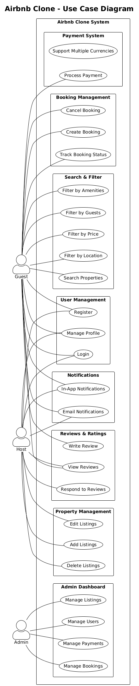

# Requirement Analysis in Software Development. 
This Repository focuses on crafting a comprehensive foundation for software development by documenting, analyzing, and structuring requirements. Through a series of well-defined tasks, learners will create a detailed blueprint of the requirement analysis phase for a booking management system. This project simulates a real-world development scenario, emphasizing clarity, precision, and structure in defining requirements to set the stage for successful project execution.

### What is Requirement Analysis?
Requirement Analysis is the process of defining, documenting, and managing requirements of a system to be developed. It serves as the foundation for the entire project because incorrect or incomplete requirements can lead to costly rework, delays, or even project failure.

This process involves:
- Eliciting Requirements – Collecting information from stakeholders, customers, and end-users.
- Analyzing Requirements – Understanding the feasibility, consistency, and completeness.
- Specifying Requirements – Writing detailed requirement specifications (e.g., SRS document).
- Validating Requirements – Ensuring requirements meet stakeholder needs and are achievable within constraints.

### **Why is Requirement Analysis Important?**

Requirement Analysis is a **critical phase in the Software Development Life Cycle (SDLC)** because it forms the foundation for all subsequent stages. Without a clear understanding of requirements, the entire project is at risk of failure. Below are three key reasons why Requirement Analysis is important:

---

#### **1. Prevents Misunderstandings and Miscommunication**
- **Description:**  
  Requirement Analysis ensures that both stakeholders and developers share a **common understanding** of the system’s objectives and functionalities.  
- **Why it matters:**  
  Miscommunication often leads to **incorrect features**, wasted effort, and dissatisfied clients. Proper analysis creates clear, unambiguous documentation that all parties agree on.

---

#### **2. Reduces Cost and Time Overruns**
- **Description:**  
  Detecting and correcting requirement errors in the early stages is much cheaper than fixing them after development or deployment.  
- **Why it matters:**  
  According to industry studies, fixing a defect during design costs **10 times less** than fixing it after implementation. Thorough analysis minimizes **rework**, **delays**, and **budget overruns**.

---

#### **3. Improves Product Quality**
- **Description:**  
  Clear, well-documented requirements serve as the **blueprint** for design, development, and testing.  
- **Why it matters:**  
  It ensures the final product meets **functional** and **non-functional** requirements, resulting in a solution that aligns with user expectations and performs effectively under real-world conditions.

### **Key Activities in Requirement Analysis**

Requirement Analysis consists of several structured activities that help ensure the software meets stakeholder needs effectively. Below are the five key activities:

---

#### **1. Requirement Gathering**
- **Description:**  
  This is the initial step where information about the system is collected from stakeholders such as clients, end-users, and domain experts.  
- **Objective:**  
  To understand the **high-level needs**, **business goals**, and **expectations** of the project.  
- **Techniques:**  
  - Stakeholder meetings  
  - Reviewing existing documents  
  - Market and competitor analysis  

---

#### **2. Requirement Elicitation**
- **Description:**  
  In this phase, the team **extracts detailed requirements** through interaction with stakeholders to uncover explicit and implicit needs.  
- **Objective:**  
  To identify both **functional** and **non-functional requirements** that might not be immediately obvious.  
- **Techniques:**  
  - Interviews  
  - Brainstorming sessions  
  - Questionnaires and surveys  
  - Observation and workshops  

---

#### **3. Requirement Documentation**
- **Description:**  
  After gathering and eliciting requirements, they are formally documented in a structured format such as the **Software Requirement Specification (SRS)**.  
- **Objective:**  
  To create a **clear, comprehensive, and unambiguous record** of all requirements that will serve as a reference throughout the project.  
- **Key Outputs:**  
  - SRS Document  
  - Use case diagrams  
  - User stories  

---

#### **4. Requirement Analysis and Modeling**
- **Description:**  
  This step involves **analyzing requirements for completeness, feasibility, consistency, and priority**. Modeling is used to represent requirements visually for better understanding.  
- **Objective:**  
  To ensure requirements are logically organized, free of conflicts, and achievable within given constraints.  
- **Tools & Techniques:**  
  - UML diagrams (Use Case, Activity, Class)  
  - Data Flow Diagrams (DFD)  
  - Entity-Relationship Diagrams (ERD)  

---

#### **5. Requirement Validation**
- **Description:**  
  Validation ensures that the documented requirements **accurately reflect stakeholder needs** and are technically and financially feasible.  
- **Objective:**  
  To confirm that requirements are **correct, complete, and testable** before moving to the design phase.  
- **Techniques:**  
  - Requirements review meetings  
  - Prototyping  
  - Walkthroughs and inspections  

---

### **Types of Requirements**

In a booking management system (similar to hotel booking platforms like Airbnb or OYO), requirements are generally categorized into **Functional** and **Non-functional** requirements.

---

#### **1. Functional Requirements**
**Definition:**  
Functional requirements specify **what the system should do** — the core features and operations that must be implemented for the system to achieve its goals.

**Examples for Booking Management System:**  
- **User Authentication:** Users should be able to register, log in, and log out securely.
- **Search and Filter Hotels:** Users can search for hotels based on location, price, and availability.
- **Room Booking:** The system should allow users to book rooms for specific dates and make payments.
- **Booking Management:** Users can view, cancel, or modify their bookings.
- **Host Management:** Hosts should be able to list properties, set prices, and manage availability.
- **Notifications:** The system should send email or SMS notifications for booking confirmations and reminders.

---

#### **2. Non-functional Requirements**
**Definition:**  
Non-functional requirements define **how the system should perform** rather than the specific functionalities. They focus on quality attributes like performance, security, and usability.

**Examples for Booking Management System:**  
- **Performance:** The system should handle at least **10,000 concurrent users** without performance degradation.
- **Availability:** The system must ensure **99.9% uptime** for critical booking operations.
- **Scalability:** The platform should scale horizontally to support a growing number of users and properties.
- **Security:** All transactions and personal data must be encrypted using **SSL/TLS** protocols.
- **Response Time:** Search results should be displayed within **2 seconds**.
- **Usability:** The interface should be **responsive and accessible** on mobile and desktop devices.

---

### **Use Case Diagrams**

**Definition:**  
A **Use Case Diagram** is a visual representation of the interactions between **users (actors)** and a **system**, illustrating the different ways users can interact with the system to achieve specific goals. It is part of **Unified Modeling Language (UML)** and is commonly used during the **Requirement Analysis** phase of SDLC.

Use Case Diagrams focus on **what the system should do** rather than **how it will do it**. They provide a high-level overview of the system's functionality from the end-user perspective.

---

#### **Key Components of a Use Case Diagram**
- **Actors:** Entities (users or other systems) that interact with the system (e.g., Customer, Admin, Payment Gateway).
- **Use Cases:** Specific actions or tasks the system performs for an actor (e.g., Book Room, Cancel Reservation, Make Payment).
- **System Boundary:** Defines the scope of the system being modeled.
- **Relationships:** Connections between actors and use cases (e.g., associations, include, extend).

---

### **Benefits of Use Case Diagrams**
1. **Clarifies System Scope and Boundaries**  
   - Shows what the system will do and what lies outside its boundary.

2. **Improves Communication with Stakeholders**  
   - Provides a simple and intuitive way for **non-technical stakeholders** to understand system functionality.

3. **Identifies Functional Requirements Early**  
   - Helps capture all possible interactions between users and the system.

4. **Serves as a Foundation for Design and Testing**  
   - Use cases can be used to **design workflows** and **create test cases** for validation.

5. **Helps Detect Missing Requirements**  
   - Visualizing interactions can reveal overlooked functionalities or roles.

---

---
### **Acceptance Criteria**

**Definition:**  
Acceptance Criteria are a set of **predefined conditions or requirements** that a software product or feature must meet to be **accepted by stakeholders**. They serve as the **benchmark for validating** whether a feature has been implemented correctly and fulfills the intended purpose.

---

### **Importance of Acceptance Criteria in Requirement Analysis**
1. **Provides Clear Definition of Done**  
   - Acceptance Criteria define what it means for a feature or user story to be considered **complete and successful**.

2. **Aligns Stakeholder Expectations**  
   - Helps avoid misunderstandings between developers, testers, and clients by setting **clear expectations**.

3. **Facilitates Test Case Design**  
   - Acts as the basis for writing **test scenarios** and verifying the functionality during QA.

4. **Reduces Ambiguity in Requirements**  
   - Ensures requirements are **specific, measurable, and testable**, leaving no room for assumptions.

5. **Improves Quality Assurance**  
   - Guarantees that the delivered feature meets **functional and non-functional requirements** before release.

---

### **Example: Acceptance Criteria for Checkout Feature in a Booking Management System**
**Feature:** *Checkout – Complete Payment for Hotel Booking*

**Acceptance Criteria:**
- **AC1:** The user must be able to view a **summary of the booking details**, including room type, dates, and total price, before checkout.
- **AC2:** The system must allow the user to **select a payment method** (Credit Card, Debit Card, or Digital Wallet).
- **AC3:** The system must **validate payment details** (e.g., card number, CVV, expiry date) before processing.
- **AC4:** On successful payment, the system must **display a confirmation message** and send an email/SMS to the user.
- **AC5:** If the payment fails, the system must **display an error message** and allow the user to retry or change the payment method.
- **AC6:** The checkout process must be completed **within 5 seconds** for a successful transaction.
- **AC7:** All payment data must be **encrypted** using SSL/TLS during transmission.